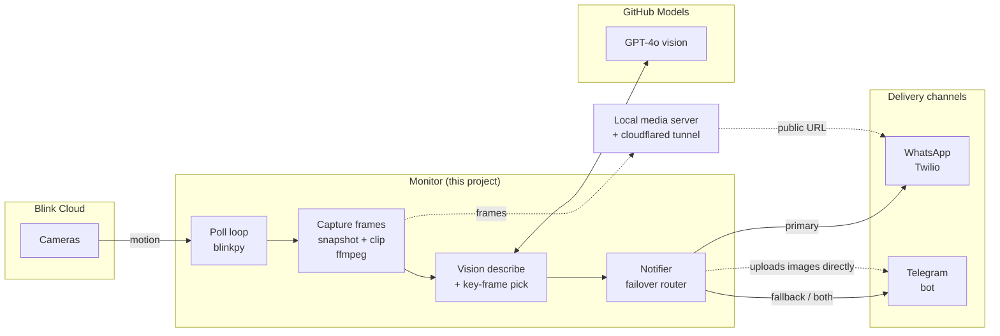

# VigilAI — AI-Narrated Home Security Alerts

> **Blink cameras + computer vision → a plain-English alert on your phone.**

VigilAI watches your [Blink](https://blinkforhome.com/) cameras and, on every
motion event, sends a **WhatsApp and/or Telegram** message with an **AI-generated
description of the activity** (e.g. *"A person is entering the house through the
front door."*) and the captured camera frames — so a glance at your notifications
tells you *what* happened, not just *that* something moved.

## Motivation

In Andrej Karpathy's ["Skill Issue" podcast appearance](https://youtu.be/kwSVtQ7dziU?t=648),
he describes wiring up **AI to monitor his home security cameras** and alert him —
effectively letting a model "watch" the feeds and tell him what's going on. That
idea is the spark for this project: instead of generic "motion detected" pings (or
scrubbing through clips yourself), a vision model watches the footage and narrates
it in human language. VigilAI is a small, self-hostable take on that concept built
on consumer Blink cameras and free/low-cost APIs.

## Architecture



Pipeline stages:

```
Blink motion ─► capture snapshot+clip frames ─► GPT-4o vision ─► WhatsApp
   (blinkpy)            (bundled ffmpeg)        (GitHub Models)  (Twilio) ─┐
                                                                          └─► Telegram
                                                                            (free fallback)
```

1. **Detect** — polls Blink; when a camera reports motion it triggers the pipeline.
2. **Capture** — grabs a fresh snapshot (instant) **plus frames sampled across
   the entire recorded clip** (at `CLIP_FPS` fps) using the ffmpeg bundled by
   `imageio-ffmpeg`, so the whole event is seen — not just the first moment.
3. **Describe** — sends the frame *sequence* (evenly subsampled to
   `VISION_MAX_FRAMES`, in chronological order, low-detail) to a vision model
   (GPT-4o via the free **GitHub Models** endpoint), which reasons over the whole
   clip to produce a one-line description of the activity and its progression,
   **and picks the single frame that best shows that activity**.
4. **Alert** — sends a message with the description, attaching frames **centered
   on that key frame** (plus a couple of neighbours, up to `MEDIA_MAX_FRAMES`) so
   the image matches the description. Delivery goes through WhatsApp (Twilio) with
   **Telegram as an automatic free fallback** (see below).

Every stage degrades gracefully: no `GITHUB_TOKEN` → generic "Motion detected";
no `PUBLIC_BASE_URL` → text-only alert; clip not ready → snapshot only.

- **Blink** has no official public API, so this uses the community
  [`blinkpy`](https://github.com/fronzbot/blinkpy) library. First login needs a
  2FA code; the session is then cached so the monitor runs headless.
- **WhatsApp** messages are sent through
  [Twilio's WhatsApp API](https://www.twilio.com/docs/whatsapp).
- **Vision** uses [GitHub Models](https://github.com/marketplace/models) (free
  with a GitHub PAT) via the `models.inference.ai.azure.com` endpoint.

## Prerequisites

1. A Blink account (email + password).
2. A Twilio account with WhatsApp enabled. For testing, the
   [Twilio WhatsApp Sandbox](https://www.twilio.com/docs/whatsapp/sandbox) works
   immediately — just send the join code from your phone first.
3. Python 3.11+.

## Setup

```powershell
# 1. Install dependencies
pip install -r requirements.txt

# 2. Configure credentials
copy .env.example .env
#    then edit .env: Blink + Twilio details, and GITHUB_TOKEN for vision

# 3. One-time Blink login (handles the 2FA code prompt)
python -m src.setup_2fa

# 4. (Optional) confirm WhatsApp works
python -m src.test_whatsapp

# 5. (Optional) enable image attachments via a tunnel
#    ngrok http 8088   ->   set PUBLIC_BASE_URL in .env

# 6. Start monitoring (runs continuously)
python main.py
```

### One-command launcher (auto tunnel + images)

`run_all.py` starts a [cloudflared](https://github.com/cloudflare/cloudflared)
quick tunnel, auto-captures its public URL (these change on every restart), and
runs the monitor with image attachments enabled — no manual `.env` edit needed:

```powershell
python run_all.py
```

It uses the bundled `bin/cloudflared.exe` (no Cloudflare account required). If
you have your own stable URL (named tunnel or ngrok), set `PUBLIC_BASE_URL` in
`.env` and run `python main.py` instead.

## Running it 24x7 (all year)

> **Want it running even when your laptop is OFF?** A powered-off machine can't
> run anything — see **[DEPLOYMENT.md](DEPLOYMENT.md)** for moving the monitor to
> an always-on host (Raspberry Pi, cloud VM, NAS, or Docker). The provided
> `Dockerfile` / `docker-compose.yml` / systemd unit run it 24/7 with auto-restart
> and **no tunnel** (Telegram uploads images directly). The Windows options below
> keep it running only while this machine is on.

For unattended, always-on operation use the **supervisor**, which runs
`run_all.py`, restarts it automatically on any crash (with exponential backoff),
and keeps the machine awake so it doesn't sleep and miss motion:

```powershell
python supervisor.py
```

> **If you get `ModuleNotFoundError: No module named 'dotenv'`** your shell's
> `python` is the wrong interpreter (often the Microsoft Store stub, or an
> elevated session that can't see your per-user Python). Run it with the **full
> path** to the Python that has the dependencies installed, e.g.:
>
> ```powershell
> & "$env:LOCALAPPDATA\Programs\Python\Python313\python.exe" supervisor.py
> ```
>
> Find the right one with `(Get-Command python).Source`, or
> `python -c "import sys; print(sys.executable)"` in a shell where imports work.

To make it start at every boot and survive logoffs/reboots, install it as a
Windows Scheduled Task (run from an **elevated** PowerShell):

```powershell
powershell -ExecutionPolicy Bypass -File .\install_service.ps1
Start-ScheduledTask -TaskName BlinkWhatsAppMonitor      # start now
Get-ScheduledTask -TaskName BlinkWhatsAppMonitor | Get-ScheduledTaskInfo   # status
powershell -ExecutionPolicy Bypass -File .\install_service.ps1 -Uninstall  # remove
```

**Important for true year-round operation:**

- **WhatsApp delivery window.** The Twilio *sandbox* only delivers inside a
  rolling 24-hour window and needs a re-join after inactivity — unusable for
  unsolicited alerts that may fire days apart. For genuine 24x7 alerting you
  must move to a **Twilio WhatsApp Business sender with an approved Content
  template** (set `TWILIO_CONTENT_SID`). Templates deliver any time.
- **Keep the host awake & powered.** The supervisor requests keep-awake, but
  also disable sleep/hibernate in Windows power settings and put the machine on
  reliable power/network. A small always-on box (mini PC, Raspberry Pi, or a
  cheap cloud VM) is more dependable than a daily-driver laptop.
- **Stable public URL (optional).** cloudflared *quick* tunnels rotate their URL
  on each restart; the launcher handles this automatically. For a fixed URL, set
  up a **named** cloudflared tunnel (or paid ngrok) and put it in
  `PUBLIC_BASE_URL`, then run `python main.py` under the supervisor instead.
- **Blink session.** The cached `blink_creds.json` refreshes automatically; if
  Blink ever forces a re-auth, re-run `python -m src.setup_2fa` once.

## Configuration (`.env`)

| Variable | Description |
| --- | --- |
| `BLINK_USERNAME` / `BLINK_PASSWORD` | Your Blink account login |
| `BLINK_CREDS_FILE` | Where the cached Blink session is stored |
| `TWILIO_ACCOUNT_SID` / `TWILIO_AUTH_TOKEN` | From your Twilio console |
| `TWILIO_WHATSAPP_FROM` | Twilio WhatsApp sender, e.g. `whatsapp:+14155238886` |
| `WHATSAPP_TO` | Destination WhatsApp number (E.164), e.g. `whatsapp:+1XXXXXXXXXX` |
| `TWILIO_CONTENT_SID` | Content template SID (`HX...`) for motion alerts. Blank = freeform text |
| `TELEGRAM_BOT_TOKEN` | Telegram bot token (free fallback). Blank = Telegram disabled |
| `TELEGRAM_CHAT_ID` | Telegram chat id to send alerts to |
| `NOTIFY_MODE` | `whatsapp_first` (default), `telegram_first`, `both`, `whatsapp_only`, `telegram_only` |
| `POLL_INTERVAL` | Seconds between Blink polls (default 15) |
| `ALERT_COOLDOWN` | Min seconds between alerts per camera (default 60) |
| `GITHUB_TOKEN` | GitHub PAT with Models access (enables vision). Blank = generic text |
| `VISION_MODEL` | Vision model name (default `gpt-4o-mini`) |
| `VISION_DETAIL` | Image detail: `low` (default, many frames), `high` (sharper — expressions/gestures, use fewer frames), `auto` |
| `CLIP_FPS` | Frames/sec sampled across the whole clip for vision (default 2) |
| `VISION_MAX_FRAMES` | Max frames sent to the model, evenly subsampled (default 16) |
| `MEDIA_MAX_FRAMES` | Max frames attached to WhatsApp, centered on the key frame (default 4) |
| `PUBLIC_BASE_URL` | Public URL serving the frames dir, to attach images. Blank = text only |
| `MEDIA_PORT` | Local port for the frame media server (default 8088) |
| `FRAMES_DIR` | Directory where captured frames are saved (default `frames`) |

## Activity descriptions (vision)

The monitor sends the captured frames to a vision model and puts the result in
the alert. It uses **GitHub Models** (free), authenticated with a GitHub PAT:

1. Create a fine-grained token at
   [github.com/settings/personal-access-tokens](https://github.com/settings/personal-access-tokens)
   with the **Models** permission (read).
2. Put it in `.env` as `GITHUB_TOKEN`.

Without a token the alert still sends, using a generic "Motion detected"
description. Note: vision describes what is *visible* in the frames — it is not
audio transcription.

The description is a **concise but informative narration** (1-2 sentences) of the
whole clip — the key action and its progression plus a few salient details like
who/what appears, anything carried, notable gestures, and direction of movement
(e.g. *"A man in a blue shirt walks in carrying a laptop, sets it down, then waves
and leaves to the right."*). For finer details like facial expressions or small
objects, set `VISION_DETAIL=high` (and lower `VISION_MAX_FRAMES`, e.g. 6–8, to
stay within the model's token limit).

## Telegram fallback (recommended for reliability)

WhatsApp via Twilio costs credits — once your trial/credit balance is exhausted,
`messages.create()` fails and **no alert is sent**. To keep alerts flowing, the
monitor supports **Telegram as an automatic, free fallback**.

Why Telegram:

- **Free and unlimited** — no per-message cost, works indefinitely.
- **Native image upload** — the bot uploads frame bytes directly, so Telegram
  alerts include images **without needing the cloudflared tunnel / `PUBLIC_BASE_URL`**.

Setup (one time):

1. In Telegram, message **@BotFather** → `/newbot`, follow the prompts. It gives
   you a bot **token** like `123456:ABC-DEF...` → put it in `.env` as
   `TELEGRAM_BOT_TOKEN`.
2. Send any message to your new bot from your phone (so it's allowed to reply).
3. Open `https://api.telegram.org/bot<TOKEN>/getUpdates` in a browser and copy
   `result[].message.chat.id` → put it in `.env` as `TELEGRAM_CHAT_ID`.

Delivery strategy via `NOTIFY_MODE`:

| Mode | Behaviour |
| --- | --- |
| `whatsapp_first` *(default)* | Try WhatsApp; if it fails, fall back to Telegram |
| `telegram_first` | Try Telegram; if it fails, fall back to WhatsApp |
| `both` | Always send on both channels (redundant) |
| `whatsapp_only` / `telegram_only` | Single channel, no fallback |

If Telegram isn't configured, behaviour is unchanged (WhatsApp only). When
WhatsApp fails and no fallback is set, the failure is now **logged loudly**
instead of being swallowed silently. Tip: `telegram_only` (or `telegram_first`)
also lets you drop the tunnel entirely, since Telegram attaches images directly.

## Attaching frame images to WhatsApp

Twilio fetches WhatsApp media from a **public URL**, so the captured frames must
be reachable over HTTP. The app runs a small local server for the frames dir; to
expose it, run a tunnel and set `PUBLIC_BASE_URL`:

```powershell
# Example with ngrok (any tunnel works)
ngrok http 8088
# then set PUBLIC_BASE_URL=https://<your-id>.ngrok-free.app in .env
```

If `PUBLIC_BASE_URL` is blank, alerts are text-only (no images). Frames are
never uploaded to third-party image hosts.

## WhatsApp message template

Unsolicited alerts must use a pre-approved **Content template** to deliver
outside WhatsApp's 24-hour window. Create one in the Twilio Content Template
Builder ("WhatsApp Card") with these fields, then put its `HX...` SID in
`TWILIO_CONTENT_SID`:

| Field | Value |
| --- | --- |
| **Header type** | `Text` |
| **Header text** | `🚨 Blink Motion Alert` |
| **Body** | `Motion was detected on your *{{1}}* camera at {{2}}.`<br>`{{3}}` |
| **Footer** | `Blink → WhatsApp Monitor` |

Variables (filled in automatically by the monitor):

| Var | Meaning | Example |
| --- | --- | --- |
| `{{1}}` | Camera name | `Front Door` |
| `{{2}}` | Timestamp | `2026-06-14 14:02:00` |
| `{{3}}` | Activity description | `Motion detected.` (later: `A person entered the view.`) |

If `TWILIO_CONTENT_SID` is left blank, the monitor falls back to a freeform
text message (only delivers inside the 24h window / sandbox).

## Project layout

```
blink-whatsapp/
├── main.py                 # entry point: runs the monitor
├── run_all.py              # launcher: auto cloudflared tunnel + monitor
├── supervisor.py           # 24x7 supervisor: restarts on crash, keeps awake
├── install_service.ps1     # register a Windows boot-start scheduled task
├── requirements.txt
├── .env.example
└── src/
    ├── config.py           # loads/validates env config
    ├── blink_client.py     # blinkpy auth + motion detection
    ├── clip_analyzer.py    # snapshot + clip frame capture (bundled ffmpeg)
    ├── vision.py           # GitHub Models (GPT-4o) frame description
    ├── media_server.py     # local HTTP server for frame images
    ├── whatsapp_client.py  # Twilio WhatsApp wrapper (text + media)
    ├── telegram_client.py  # Telegram bot wrapper (free fallback, native images)
    ├── notifier.py         # orchestrates WhatsApp + Telegram with failover
    ├── monitor.py          # continuous detect→capture→describe→alert loop
    ├── setup_2fa.py        # one-time interactive 2FA login
    └── test_whatsapp.py    # send a test message
```

## Roadmap

- [x] Describe the activity from captured frames with a vision model.
- [x] Attach frame images to the WhatsApp message (via a public media URL).
- [ ] Optionally record/transcribe clip audio (ASR) for extra context.

## Notes

- `blinkpy` is unofficial; Blink may change their backend at any time. This
  project requires the patched local copy that handles the HTTP 202 2FA flow.
- Twilio sandbox sessions expire after 24h of inactivity — re-join if alerts stop.
- Vision uses the free GitHub Models endpoint (`models.inference.ai.azure.com`);
  the newer `models.github.ai` endpoint requires a billable account.
- `.env`, `blink_creds.json`, and `frames/` hold secrets/captures and are
  git-ignored. Never commit them.

## Privacy, ethics & legal

This project records and analyses footage of people. Use it responsibly:

- **Only monitor property and spaces you own or are authorised to monitor.**
  Laws on recording (especially audio) and on filming others vary by
  country/state — comply with your local regulations.
- **Frames are not uploaded to third-party image hosts.** They are served from a
  local HTTP server and only exposed via a tunnel you control (for WhatsApp), or
  uploaded directly to your own Telegram chat. Frames sent for description go to
  the GitHub Models API per its terms.
- `blinkpy` is an **unofficial, reverse-engineered** client. Using it may be
  subject to Blink's Terms of Service; you are responsible for your own use.
- Provided **as-is, with no warranty** (see `LICENSE`). Not affiliated with
  Blink, Amazon, Twilio, Telegram, or GitHub.

## License

[MIT](LICENSE) © 2026 Vignesh Srinivasan. Bundled third-party software is
attributed in [NOTICE](NOTICE) (notably `blinkpy`, MIT © Kevin Fronczak).

